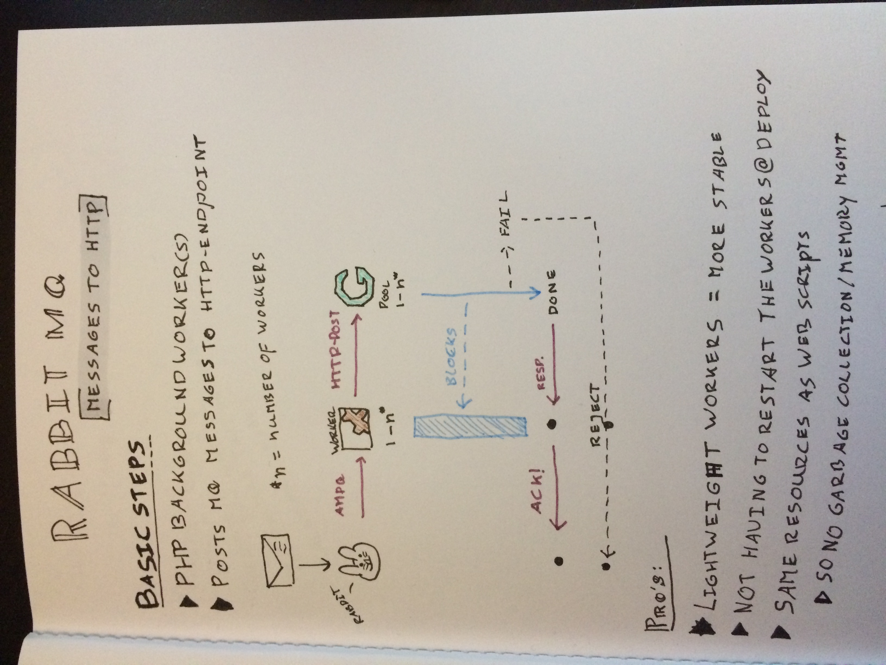

# WebQueue

A message queue worker that forwards messages to a HTTP-interface.
Particularly useful for job queue type of systems.

**This project will be split up into multiple repositories once ready for open source.**

* Project by @rtuin

## This is a short summary of the plan:

